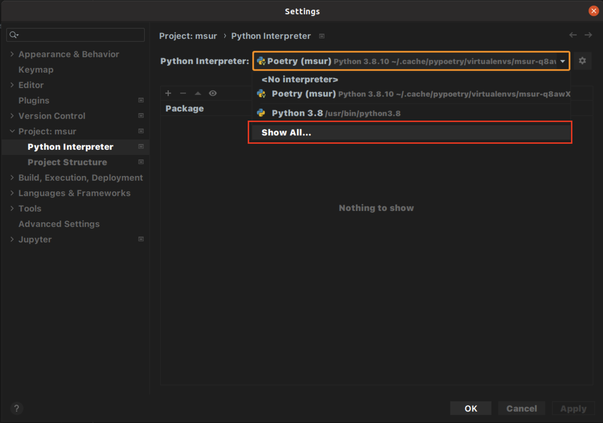
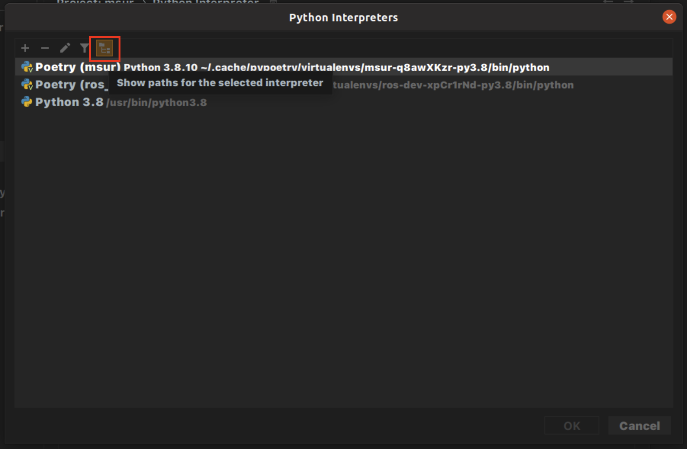
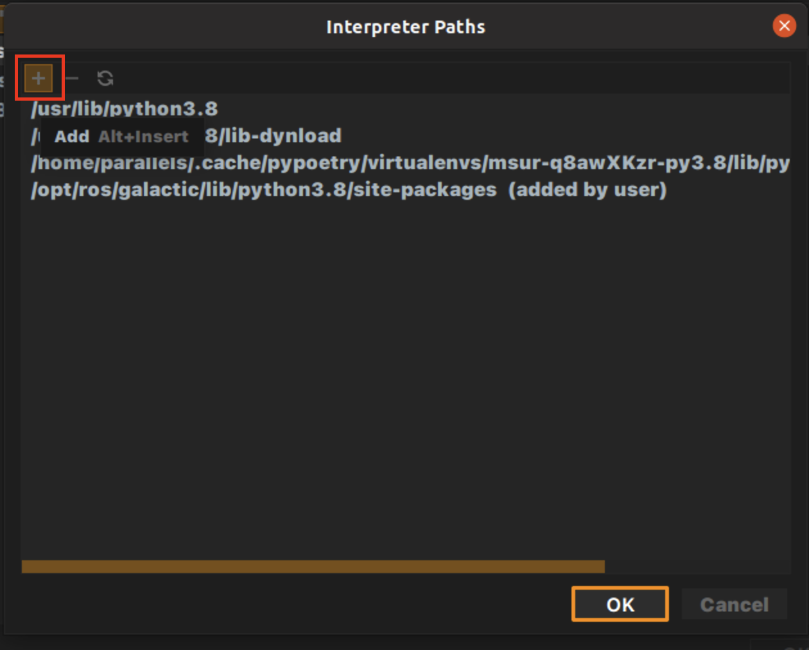
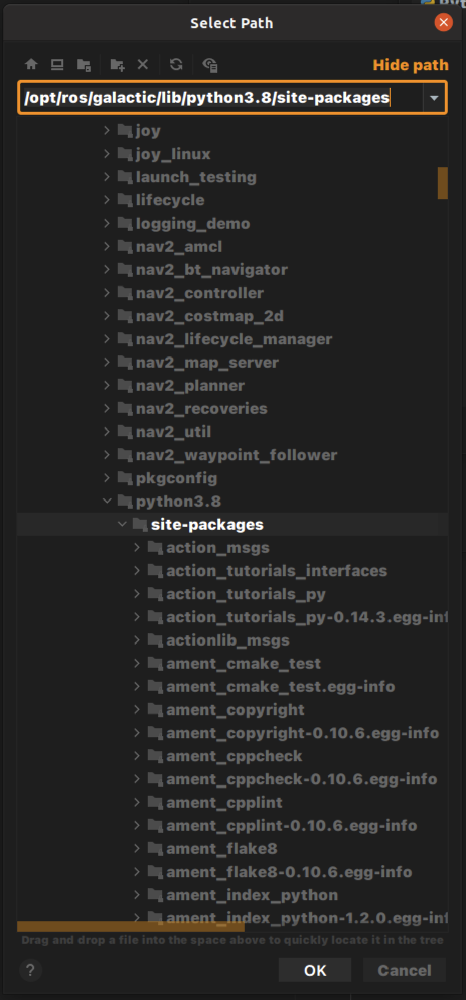

# MSUR

### Configure env for Python development
For code completion to work, you need to add the ros2 python packages

1. Open PyCharm preferences and follow `Project:msur -> Python interpreter` as picture: 

2. Add python interpreter path, as picture: 

3. Click on `Add` button: 

4. Add package path: 

